# Market Intelligence Lakehouse

End-to-end data pipeline on Azure ingesting daily OHLCV stock 
prices for AAPL, MSFT, GOOGL, AMZN and NVDA through a medallion architecture (Bronze → Silver → Gold) using ADF, Databricks, Delta Lake and dbt.

---

## Architecture

```
Alpha Vantage API
        │
        ▼
Azure Data Factory (6am UTC daily)
        │
        ▼
Databricks - Python ingestion notebook
        │  retries, exponential backoff
        │  writes raw JSON to ADLS
        │
        ▼
Databricks - PySpark bronze notebook
        │  schema enforcement, MERGE to Delta
        │
        ▼
dbt Core - silver models
        │  stg_daily_prices, stg_tickers
        │
        ▼
dbt Core - gold models
        │  fct_daily_prices, dim_ticker
        │  moving avg, volatility, returns
        │
        ▼
Databricks SQL Warehouse → Power BI
```

---

## Stack

| Tool | Why |
|---|---|
| Azure Data Factory | Orchestration - pure scheduler, no business logic |
| ADLS Gen2 | Storage - medallion zones (raw / bronze / silver / gold / logs) |
| Databricks + PySpark | Compute - ingestion and bronze transformations |
| Delta Lake | Table format - MERGE throughout, date partitioned |
| dbt Core | Silver and gold transformations with automated tests |
| Azure Key Vault | All secrets - nothing hardcoded anywhere |
| Unity Catalog | Data governance on Databricks |
| Azure DevOps | CI/CD - dbt test runs on every PR, blocks failing merges |
| Power BI | Serving layer via Databricks SQL Warehouse |

---

## Data Model

```
bronze.daily_prices
        │
        ▼
silver.stg_daily_prices - cleaned, deduplicated, typed
silver.stg_tickers      - one row per ticker
        │
        ▼
silver.int_daily_returns    - daily return % per ticker
silver.int_moving_avg_30d   - 30 day rolling average close
silver.int_volatility_30d   - 30 day rolling std dev of returns
silver.int_52wk_high_low    - 52 week high and low
        │
        ▼
gold.fct_daily_prices - OHLCV + all metrics joined
gold.dim_ticker       - one row per ticker with summary
```

28 automated dbt tests across all models.

---

## Engineering Decisions

- **MERGE not overwrite** - Alpha Vantage returns 100 days on every call, MERGE on ticker + price_date keeps reruns safe
- **pipeline_runs Delta table** - every run logs status, rows ingested, duration and error message to a Delta table in the logs zone
- **ADF as pure orchestrator** - no business logic in ADF, all compute runs in Databricks notebooks
- **Key Vault for all secrets** - ADF uses managed identity, Databricks uses a secret scope linked to Key Vault
- **CI/CD on every PR** - Azure DevOps runs dbt test before any merge to main

---

## Screenshots

### Resource Group
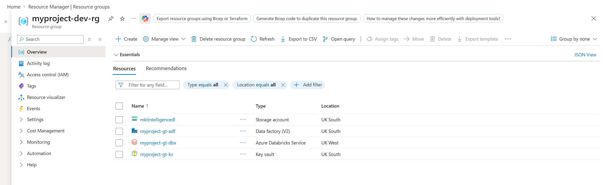

### ADLS Storage
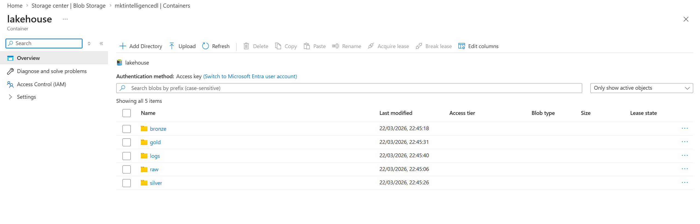

### ADF Pipeline
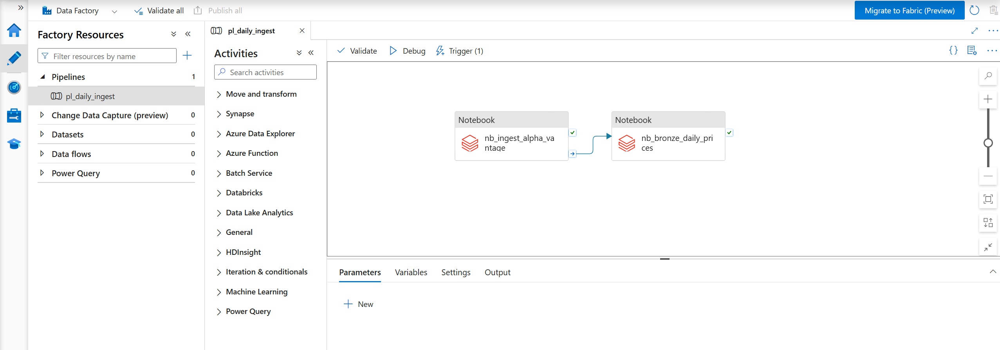

### ADF Pipeline Runs
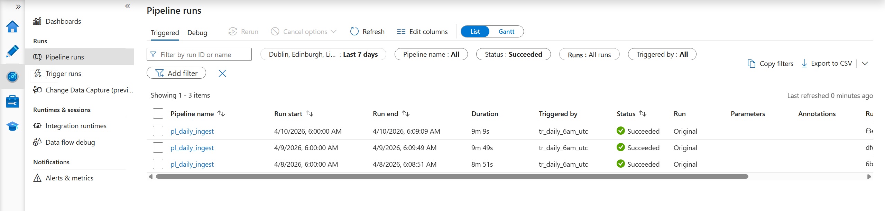

### Databricks Unity Catalog
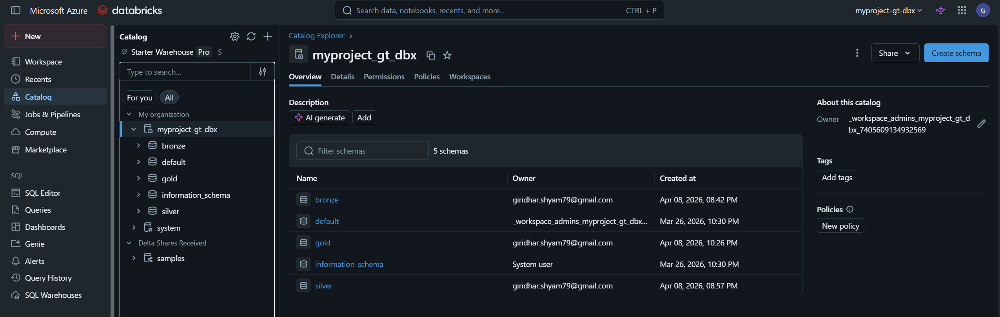

### Silver Models
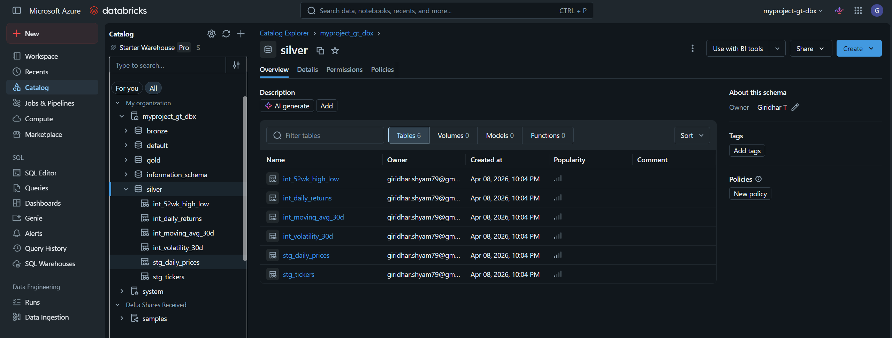

### Gold Models
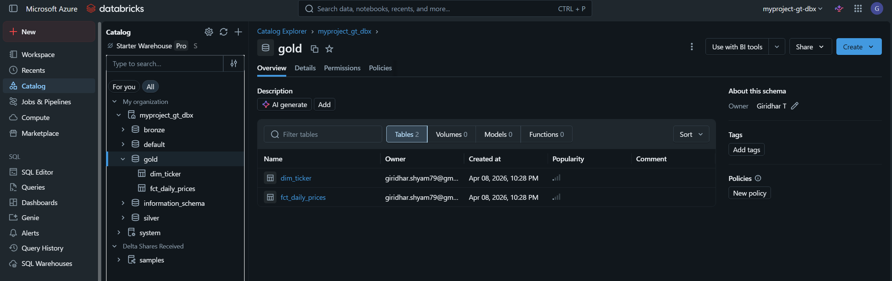

### dbt Tests - 28 Passing
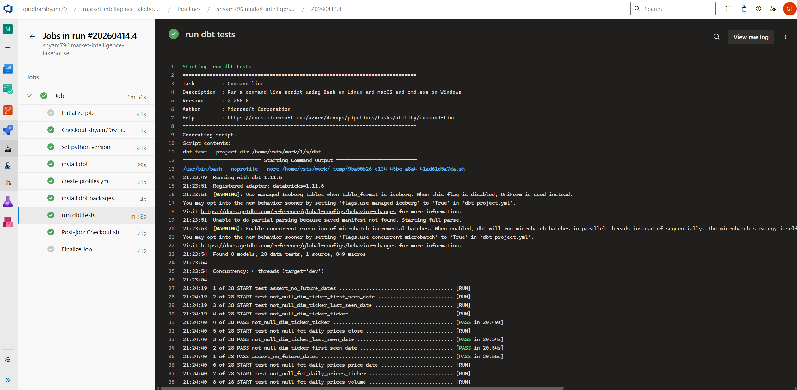
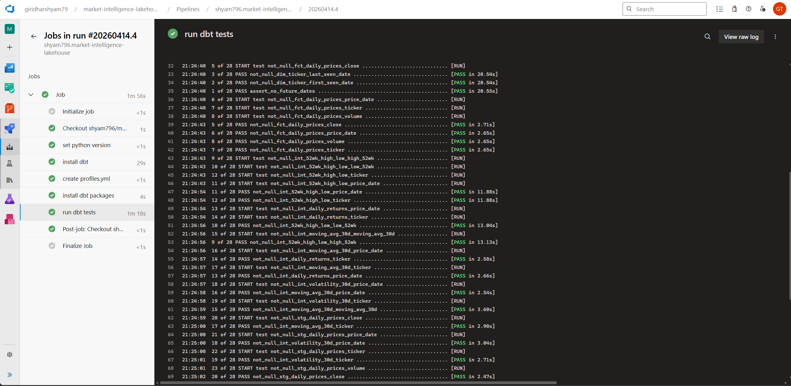
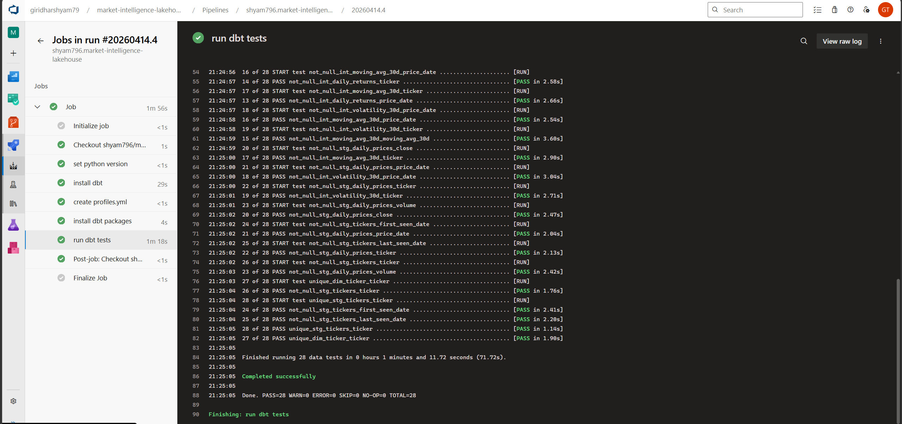

### Azure DevOps Pipeline Run
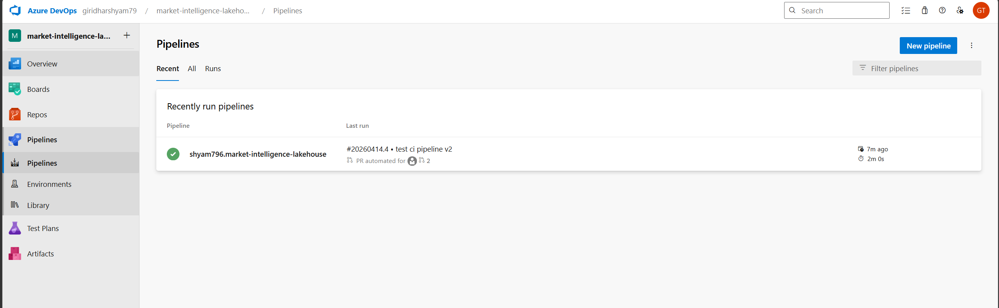

### GitHub PR Check
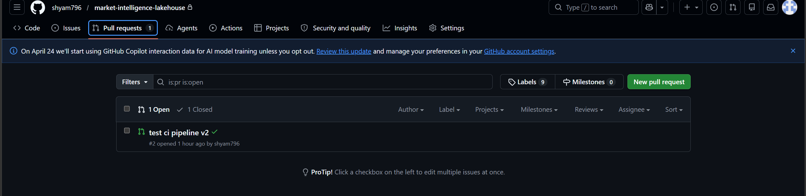

---

## How to Run

### Prerequisites
- Azure subscription with ADF, ADLS Gen2, Databricks, Key Vault set up
- Databricks SQL Warehouse running
- Alpha Vantage API key (free at alphavantage.co)
- Python 3.11+

### Key Vault secrets needed

| Secret | Value |
|---|---|
| `alpha-vantage-api-key` | Alpha Vantage API key |
| `adls-storage-account-name` | Storage account name |
| `adls-access-key` | Storage account access key |
| `databricks-workspace-url` | Databricks workspace URL |
| `databricks-access-token` | Databricks PAT |

### dbt

```bash
cd dbt
pip install dbt-databricks
dbt deps
dbt debug
dbt run
dbt test
```

---

## What's Next

- Real-time ingestion with Azure Event Hubs and Spark Structured Streaming
- AI layer - natural language querying of gold tables using Azure OpenAI and LangChain